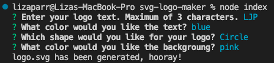

# SVG Logo Maker

## Description

The motivation behind this project was to learn more about tests and how they interact with object oriented programming, or OOP. This project was an exercise in figuring out how to get files to interact in order to produce a simple logo. I learned a lot about OOP, specifically the different ways to configure the code. I also learned a lot more about testing, and how to test for simple, small items to check your code. 

## Usage

To use this application, open your integrated terminal, enter "npm i inquirer" to install inquirer. Then, run node index, which will then prompt you with questions to create your logo. The questions & results are shown below.

Click [this link](https://watch.screencastify.com/v/c5i2ki89NuvsFs7C76B0) to watch a walkthrough video of the application.

